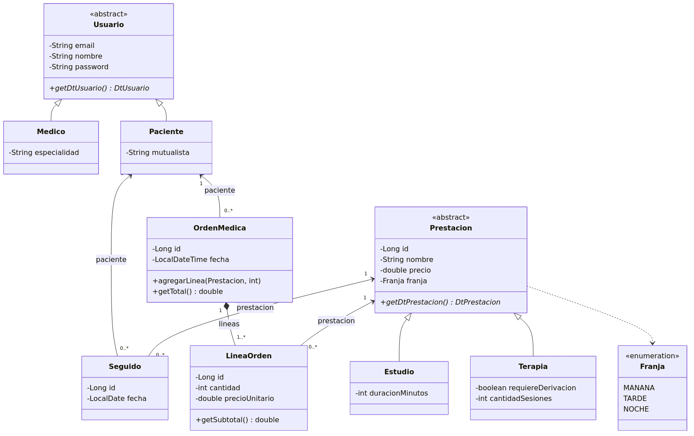

# Clínica — aplicación de escritorio

Java 21 · Hibernate 6 · PostgreSQL · Swing.

Arquitectura: `presentacion → interfaces → logica → persistencia`

La presentación no conoce las entidades: usa `IControlador` y los datatypes. El controlador se pide a `Fabrica`, no con `new`.

## Diagrama de clases



## Cómo ejecutar

Requisitos: JDK 21, Maven 3.9 o mayor y Docker Desktop (con el motor en marcha).

```bash
docker compose up -d
mvn compile exec:java
```

`mvn exec:java` no recompila. Si cambiaste código, usá `mvn compile exec:java`.

Apagar la base: `docker compose down`.  
Borrar los datos y empezar de cero: `docker compose down -v`.

## Convención para ramas

Las ramas deben seguir estas convenciones:

- Nuevas funcionalidades: `feature-nombre-descriptivo`
- Correcciones: `fix-nombre-del-error`

Se deben usar minúsculas y separar las palabras con guiones. Por ejemplo:

```text
feature-gestion-usuarios
fix-error-inicio-sesion
```
